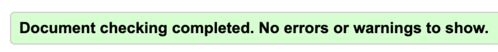

# Home Remedies

## Description

**Home Remedies** is all about small remedies you can try out at home.
Instructions are clear and it's easy to find what you need.

What do you do when you spill something on your favourite shirt or desperate for a cure when you're sick.
We might not have the cure but a few good tips and tricks to make you feel a little bit better.
If you like this website you can sign-up to get new updates for new home remedies.
Or you could leave a message if you have a good one yourself,
it's up to you if you want to leave a message or not.

## Index - table of contents

* [Description](#description)
* [Index - Table of contents](#index-table-of-contents)
* [User Experience](#user-experience)
* [Structure](structure)
* [Features](#excisting-features)
* [Design](#design)
* [Technologies used](#technological-used)
* [Tools Used](#tools)
* [Tests](#testing)
* [Deployment](#deployment)
* [Credits](#credits)

## User Experience

* A.First Time Visitor Goals
  * a. As a first time visitor, I want to easily understand the websites purpose and find out more about it.
  * b. As a first time visitor, I want to navigate fast and easily on the site to find what I´m looking for.
  * c. As a first time visitor, I want to understand the purpose of the websites conent.
  
* B.Returning Visitor Goals
  * a. As a returning visitor, I want to easily navigate to the menu to find what I´m looking for.
  * b. As a returning visitor, I want to find the links easily and take me to the right place.
  * c. As a returning visitor, I want to easily contact the organisation for questions or to get newsletters.
  
* C,Frequent User Goals
  * a. As a Frequent visitor, I want to be able to sign up with my email for any news of new remedies or share wisdom.
  

## Existing Features
  
   ### F1, Navigationbar
      The navigation bar has a simple and easy navigation to it on all devices.
      It´s easy to find the different locators like "Stains", "Feeling sick?" "Sidney Rez" and "Sign-Up".
      It lights up when the user hovers over the text, making it easier for them to see what part they might klick on.
  
  ### F2, Main image
      The main image is used to point out what vibe the site is giving out.
      A lightbulp with a bright light giving the impression that this website has a "Idea" or a "solution" to something.
      Animating zoom effect going from big to smal, creating a nice enviroment on the website.

  ### F3, Iframe video
      The main purpose of the iframe video is to show the visitor what they can discover themselves if they think outside the box. Do they have a life hack or home remedy, they might get inspired and leave a comment to the website to create more content.
      The video is fast with it's purpose user gets their answers fast and a little bit about life-hacks or remedies.

  ### F4, Icons with a href
      three icons being used at the end of the website, allowing user to click on them to take them where the icon(logo) is but in another tab.

  ### F5, Footer
      The footer contains what is needed for the visitor to take the next step.
      Discover more throughout Instagram, Facebook or Twitter.

## Design

### Imagery
    I wanted the whole page to have one common thread.
    When menu is hovered over, color yellow will appear to be the same as the hero image.
    The brown in the main image goes well togheter with the other colors on the page.

### Sections
    I wanted the most important content to be closer to the top of the page.
    By dividing up paragraphs in boxes using border color and box shadowing it's easier to read.
    
      
### Color Scheme
    Using 3 different shades of brown to have a red-thread in the website.
    Only yellow is used in hero image and the hover color for the menu.
* 
    
      
### Typography
    I wanted to use a fun font for my header, h1/h2´s and a more serious one for the text content in the rest of the page.
    The colors are soft to the eye and goes well togheter.
      
### Media query
    Making the website match on different tablets from 320px and up to 3820px.
    Using flexbox in css making it easier to write the media queries making the code shorter and more readable.

## Technological used
  
### Language used,
HTML5 
CSS3
      
### Programs and Libraries used,
[Google fonts](https://fonts.google.com/about) used to import "Roboto Slab", serif" and "Rubik Microbe"

[Font Awesome](https://fontawesome.com/) used to get icons for the footer links and up-button.

[Github](https://github.com/)/[Gitpod](https://www.gitpod.io/) used to save code, commits and pushes.

## Validator test
      
### HTML:
Trying to pass my code in HTML the first time gave me 1 warning and 1 error. It was an easy fix to solve these problems. I'll insert a before picture along with a after picture when code is fixed.
* 
* 

### CSS:
No problems with this part of the code.
* 

## Credits

### Media
      
Icones comes from https://fontawesome.com/

font type comes from https://fonts.google.com/knowledge

Used as an inspiration for creating a button to take user to the top of the page [Debbie Herridge](https://debbie-herridge.github.io/mindfull-meditation/)
      
Needed a reminder of how buttons work, that i found [here]()
      
Hero image was downloaded from [here]()