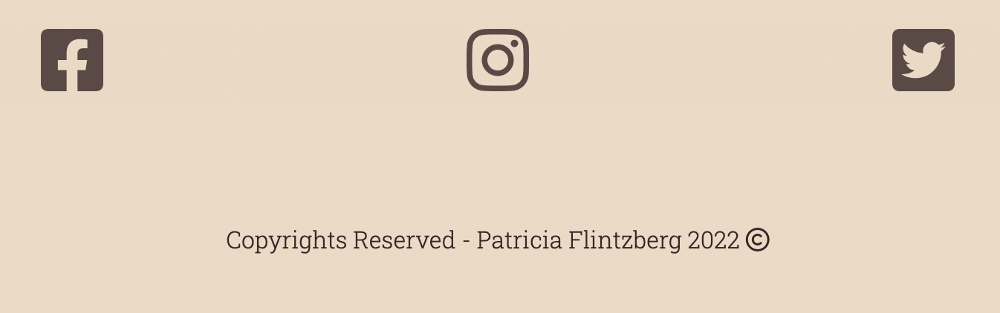
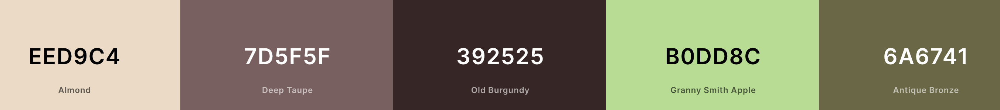
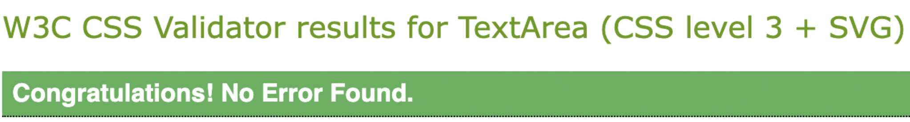

# Home Remedies

## Description

**[Home Remedies](https://pisen99.github.io/project-1.resub/)** is all about small remedies you can try out at home.
Instructions are clear and it's easy to find what you need.

What do you do when you spill something on your favourite shirt or desperate for a cure when you're sick.
We might not have the cure but a few good tips and tricks to make you feel a little bit better.
If you like this website you can sign-up to get new updates for new home remedies.
Or you could leave a message if you have a good one yourself, it's up to you.

## Index - table of contents

* [Description](#description)
* [Index - Table of contents](#index-table-of-contents)
* [User Experience](#user-experience)
* [Features](#existing-features)
* [Design](#design)
* [Technologies used](#technological-used)
* [Tests](#validator-test)
* [Deployment](#deployment)
* [Credits](#credits)

## User Experience

* A.First Time Visitor Goals
  * a. As a first time visitor, I want to easily understand the websites purpose and read more about it.
  * b. As a first time visitor, I want to navigate fast and easily on the site to find what I´m looking for.
  * c. As a first time visitor, I want to understand the purpose of the websites conent.
  
* B.Returning Visitor Goals
  * a. As a returning visitor, I want to easily navigate to the menu to find what I´m looking for.
  * b. As a returning visitor, I want to find the links easily and take me to the right place.
  * c. As a returning visitor, I want to easily contact the organisation for questions or to get newsletters.
  
* C,Frequent User Goals
  * a. As a Frequent visitor, I want to be able to sign up with my email for any news of new remedies or share wisdom.
  

## Existing Features
  
   ### F1, Navigationbar
      The navigation bar has a simple and easy navigation to it on all devices.
      It´s easy to find the different locators like "Stains", "Sick?" "Tips!" and "Sign-Up".
      It lights up when the user hovers over the text, creating a animating effect and improving the page.
* 

  ### F2, Hero image
      The hero image is used to point out what vibe the site is giving out.
      A little mixture of mixing matcha tea, creating a feeling of home remedies.
      Animating zoom effect going from big to smal, creating a nice enviroment on the website.
* 

  ### F3, Iframe video
      The main purpose of the iframe video is to show the visitor what they can discover themselves if they think outside the box. Do they have a life hack or home remedy, they might get inspired and leave a comment to the website allowing the website to grow.

  ### F4, Icons with a href
      three icons being used at the end of the website, allowing user to click on them to take them where the icon(logo) is but in another tab.

    ### F5, Scroll up button
        Creating a button to float along on the side as the user scrolls on website.
        Giving them the option to click on the up icon button and go back to top where they can accsses the menu again.
        I used anchor element to make the button and put an icon inside of it.
        I styled it to have a green see through effect, that way it wont be taking over other content. I struggled a little bit to find the right colors, eventually I figured something out that works good & moved the button to the right side.

        I realized the footer was covering a smal part of the button on a specific place. I fixed it by adding a z-index to 1. I'll insert a before & after I saw the problem and fixed it:
* 
* 
* 
    

  ### F6, Footer
      The footer contains what is needed for the visitor to take the next step.
      Discover more of throughout Instagram, Facebook or Twitter.
* 

## Design

### Imagery
    I wanted the whole page to have one common thread.
    When menu is hovered over, color green will appear to be the same as the hero image.
    The brown in hero image goes well togheter with the other colors on the page.
    After trying different images I decided to settle with realistic pictures, instead of cartoon like my plan was from the start

### Sections
    I wanted the most important content to be closer to the top of the page, creating a bigger chance to catch user's attention.
    By dividing up paragraphs in boxes using border color and box shadowing it's easier to read.
    
      
### Color Scheme
    Using 3 different warm colors to have a red-thread in the website.
    Almond color is set to the background, creating a warm tone.
    Deep Taupe is used for the border on sign-up form and paragraphs.
    Old Burgundy is used for shadowing boxes, the text color to headings, paragraphs and icons.
    Granny Smith Apple is only used in hero image and scroll up button.
    Antique Bronze is used for the hover effect on the menu, I wanted the color to match the hero-image.
* 
    

### Typography
    I wanted to use a fun font for my header, h1/h2´s and a more serious one for the text content in the rest of the page.
    The colors are soft to the eye and goes well togheter.
      

### Media query
    Making the website adjust on different tablets from 320px and all the way up to 3820px.
    Flexbox is a great tool to use in css, it makes media queries easier to write and code shorter and more readable.

### Scroll up button
    My first attempt to build a buttton that can take user up to menu again worked okay. I tried to create a button like [Debbie Herridge](https://debbie-herridge.github.io/mindfull-meditation/) had done. But realised there must be an easier way.
    So I took an anchor element and put an icon inside.
    Styled it to be transparent in both the icon and anchor element, this took away the background color my "button" had.

## Technological used
  
### Language used,
**HTML5** 

**CSS3**
      
### Programs and Libraries used,
[Google fonts](https://fonts.google.com/about) used to import "Roboto Slab", serif" and "Rubik Microbe"

[Font Awesome](https://fontawesome.com/) used to get free icons for the footer links and up-button.

[Coolor Scheme](https://coolors.co/) Used to showcase colors used for this website.

[Am I Responsive](https://ui.dev/amiresponsive) used to check responsivness.

[Online PNG to webp](https://ezgif.com/png-to-webp) used when converting images.

[HTML](https://validator.w3.org/#validate_by_uri)/[CSS](https://jigsaw.w3.org/css-validator/) validators used to test code.

[Github](https://github.com/)/[Gitpod](https://www.gitpod.io/) used to save code, commits and pushes.

## Tests

### Validator test
      
* ### HTML:
    * Trying to pass my code in HTML the first time gave me 1 warning and 1 error. It was an easy fix to these problems. I removed width and height from Iframe video in HTML. Writing the styling in css instead and removing the frameboard compleatly from the video. I'll insert a before picture along with a after picture when code is fixed.
    * 
    * 

* ### CSS:
    * No problems with this part of the code.
    * 

* ### Lighthouse:
    * Trying this out the first time both mobile & desktop didn't come out as planned. The performance was very low on mobile, so I converted the images to webp. It changed a little bit, although the main problem seems to be the youtube video in my website.
    I'll insert images of what It looks like now.

    Now,
    * 
    * 
    Before,
    * 

* ### Test cases & result:
    * 

## Deployment

* The site was created in GitHub pages, these are the steps to deploy:
    * Log in to GitHub and go to repositories.
    * In GitHub on the right side of the repository click on settings.
    * In settings on the left side menu select "Pages".
    * Under branch, select "Main" and select folder "(Root)"
    * Press save and the page will automatically refresh and your site will be att the top. It might take a few minutes, be patient.

## Credits

### Content
All content in the "Stains" and "Feeling sick?" sections in this site were written by me with my own experiences.

### Media
Used as an inspiration for creating a button to take user to the top of the page [Debbie Herridge](https://debbie-herridge.github.io/mindfull-meditation/)
      
Needed a reminder of how buttons work, that I found [here](https://www.w3schools.com/tags/tag_button.asp)

Created box effect on paragraphs, used this [video](https://www.youtube.com/watch?v=9e-lWQdO-DA)

Created a text area for visitor to leave a message, used this [video](https://www.youtube.com/watch?v=0X0kovjzLrw&t=15s)

Images used for this website in following order:
1. ["Hero" image](https://keybroker.se/kundcase/kundaktivering-med-omnichannel)
2. ["Stains" image](https://www.chemdryofomaha.com/specialty-stain-removal/)
3. ["Feeling sick" image](https://food.ndtv.com/food-drinks/home-remedies-ginger-honey-pepper-lemon-water-may-help-ease-cold-and-cough-2243952)
4. [Youtube video](https://www.youtube.com/watch?v=MQcQGAymDJM&t=1s)